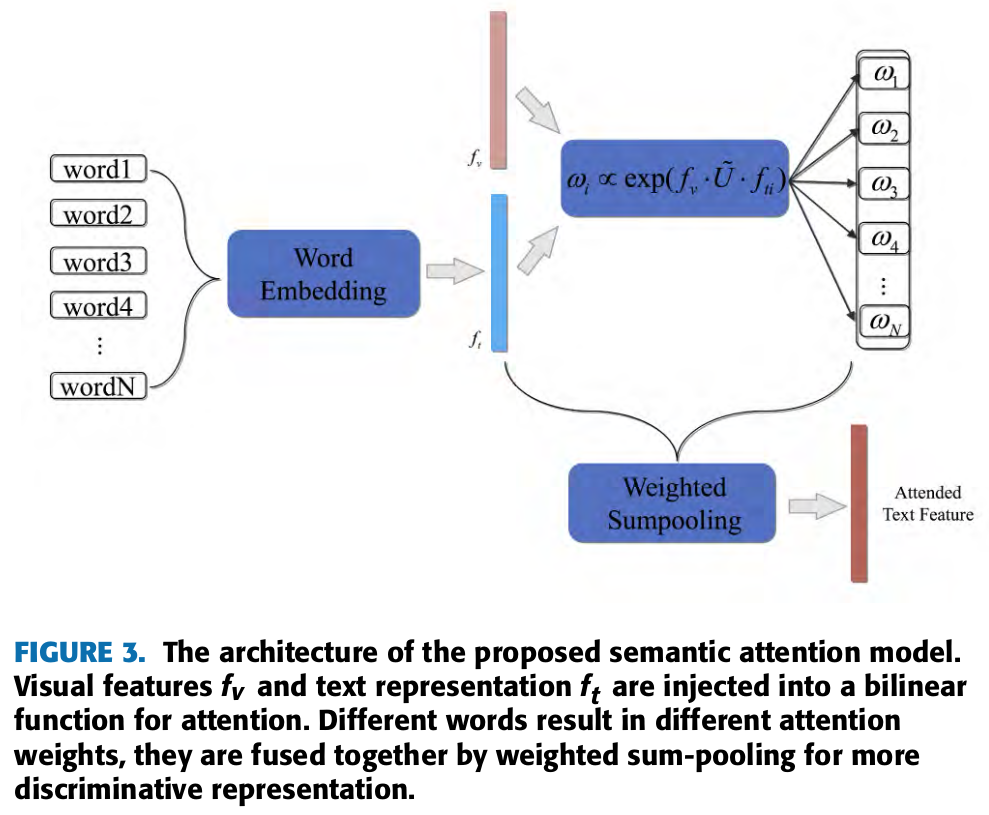

# Bai et al, 2018
Multimodal classification code, implementing Bai et al, 2018 (https://arxiv.org/abs/1704.04613)

Text is Korean

# How to Run

1. Download dataset from https://drive.google.com/file/d/1DLI7_VnDe4xDo2gcK-T-s3J26JOrMrt7/view?usp=sharing
2. and extrat it : `tar -xzf data_bai.tar.gz`
3. `python data_loader.py` for process the raw data
4. `python model_builder_bae.py` for download pretrained InceptionNet
5. `python train_bai.py` for training the model
