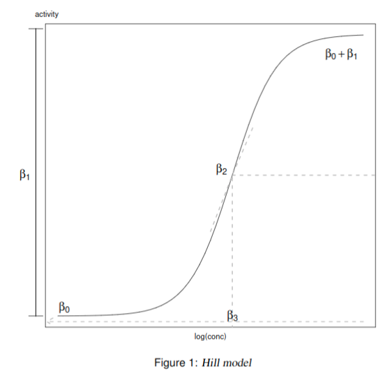
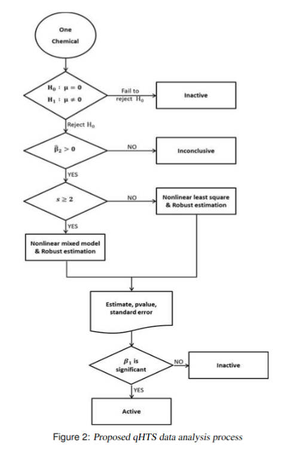

# Robust Nonlinear Mixed effect regression
Implementation with R

Simulation code, thus no need for real data

Just run `r simulation_run.R`

# Overview of suggesting process
The data is about 10,000 chemicals' assay data, each of which (ideally) can be plotted as below

We suggest to process this dataset with the following process

